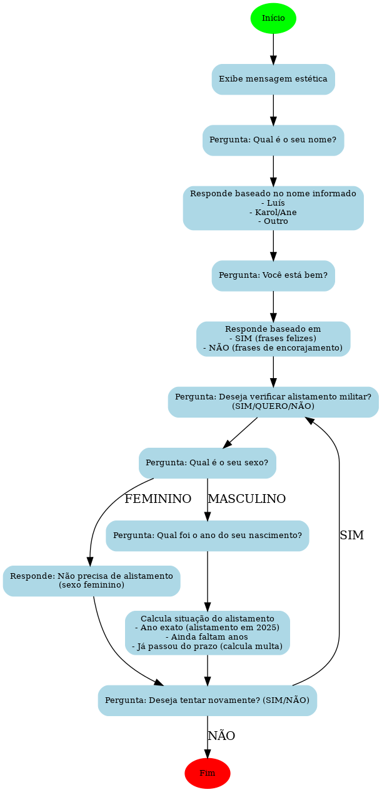

# Terminal de Alistamento Militar

Este projeto foi desenvolvido como parte de um desafio acadêmico, com o propósito de disponibilizar informações preliminares sobre a data de alistamento militar do usuário, com base em seu ano de nascimento.

### **Sobre Mim:**

Sou uma pessoa que gosta de prestar atenção nos detalhes e, às vezes, acabo me preocupando mais com a forma do que com o significado. Para deixar o projeto mais interessante, criei um robô chamado ASCE, que interage com o usuário. Antes de apresentar o projeto, ASCE bate um papo com o usuário de um jeito descontraído, como se fosse uma criança curiosa, tentando entender o mundo ao seu redor.

### **Desafios e Aprendizados:**

Apesar de já utilizar essa tag há algum tempo, o maior desafio enfrentado foi em relação ao uso da estrutura while, que ainda considero confusa. Contudo, consegui desenvolver o projeto com sucesso, utilizando a documentação como material de apoio.

O algoritmo, de modo geral, foi desenvolvido de forma rápida. Entretanto, o que mais demandou tempo foi compreender como implementar corretamente a estrutura while e trabalhar na parte de interação 'humanizada' com o usuário. Esse aspecto exigiu um cuidado especial para criar uma experiência mais envolvente e divertida.

### **O Que Vem Por Aí:**

No futuro, pretendo desenvolver um sistema de hospedagem e aprimorar minhas habilidades em desenvolvimento web, com o objetivo de oferecer uma interface dinâmica e visualmente atraente. Atualmente, estou estudando HTML, CSS e Flask, buscando capacitação para entregar um serviço mais completo e de qualidade.

### **Observações Importantes:**

Vale destacar que o programa ainda não possui uma interface gráfica (front-end). Ou seja, ele só roda no terminal. Para dar início ao uso, o usuário deve chamar o ASCE, como se estivesse começando uma conversa em um chat, como no WhatsApp, por exemplo.

## Tabela de Conteúdos

- [Arquitetura](#arquitetura)
- [Features](#features)
- [Contribua com o Projeto](#contribua-com-o-projeto)
- [Extra](#extra)


## **Arquitetura**



Aqui está uma explicação detalhada do seu código Python, junto com uma descrição do funcionamento de cada parte e como as "tags" ou funções estão operando:

---

### **1. Bibliotecas Importadas**

```python
import time
import random
```

- **`time`**: A biblioteca `time` é usada para manipulação de tempo. Neste código, a função `time.sleep()` é usada para pausar o programa por um número de segundos. Isso ajuda a criar uma sensação de que o programa está esperando ou processando antes de continuar.
  
- **`random`**: A biblioteca `random` é usada para gerar números ou escolher elementos aleatórios de uma lista. Aqui, ela é usada para escolher aleatoriamente uma frase das listas `estoubem` e `estoumal`.

---

### **2. Estética e Formatação do Texto**

```python
print('{:=^40}'.format('Desafio 39'))
print('{:80}'.format(40 * '='))
```

- **`print()`**: A função `print()` exibe informações no terminal ou console.
- **`'{:=^40}'.format('Desafio 39')`**: Esta linha formata o texto "Desafio 39" centralizado com um total de 40 caracteres. O `=` preenche o restante do espaço.
  
- **`'{:80}'.format(40 * '=')`**: Aqui, o comando imprime uma linha de 80 caracteres preenchida com o símbolo `=`. Isso serve como uma linha de separação visual para melhorar a legibilidade.

---

### **3. Entrada de Nome e Resposta Condicional**

```python
nome = input('Olaaaa!!!!! Eu me chamo ASCE, como é seu nome ?  ').strip().upper()
```

- **`input()`**: A função `input()` solicita que o usuário insira algo no console. O valor inserido é armazenado na variável `nome`.
- **`strip()`**: O método `strip()` remove espaços em branco extras ao redor da entrada do usuário.
- **`upper()`**: O método `upper()` converte a entrada para letras maiúsculas, garantindo que a comparação de nomes seja feita de forma consistente.

```python
if nome == 'LUIS' or nome == 'LUÍS':
    print('Iaew cara, suavidade ?')
elif nome == 'KAROL' or nome == 'ANE':
    print('Fala guria')
else:
    print('É um prazer em te conhecer!!!!')
```

- **`if` / `elif` / `else`**: São instruções condicionais. O programa verifica se o nome do usuário corresponde a algum dos valores predefinidos (como `'LUIS'` ou `'KAROL'`).
  
- **`print()`**: Exibe a mensagem apropriada com base no nome do usuário.

---

### **4. Pergunta sobre Emoção**

```python
emoção = input('Você está bem? ').strip().upper()
```

- **`input()`**: Solicita que o usuário informe se está bem ou não.
- **`strip()` e `upper()`**: Garantem que a entrada seja limpa de espaços e convertida para maiúsculas.

```python
while emoção not in ['SIM', 'NÃO']:
    emoção = input('Eu sou meio binário, vai ter que escolher entre SIM e NÃO :D : ').strip().upper()
```

- **`while`**: Esse loop continuará até que o usuário digite "SIM" ou "NÃO". Ele serve para garantir que a entrada seja válida.

---

### **5. Resposta sobre Emoção (Frase Aleatória)**

```python
if emoção == 'SIM':
    frase = print(random.choice(estoubem))
else:
    frase = print(random.choice(estoumal))
```

- **`random.choice()`**: Escolhe aleatoriamente um item das listas `estoubem` ou `estoumal`, dependendo da resposta do usuário.
- **`print()`**: Exibe a frase escolhida.

---

### **6. Pergunta sobre o Alistamento Militar**

```python
duvida = input('Aprendi uma nova utilidade... Quer ver?: ').strip().upper()
```

- **`input()`**: Pergunta ao usuário se deseja ver a funcionalidade sobre alistamento militar.

```python
while duvida not in ['SIM', 'NÃO', 'QUERO']:
    duvida = input('Eu sou meio binário, vai ter que escolher entre SIM e NÃO :D : ').strip().upper()
```

- **`while`**: Garante que o usuário só possa responder com "SIM", "NÃO" ou "QUERO".

---

### **7. Cálculo do Alistamento Militar**

```python
while True:
    sexo = input('Você tem o sexo masculino ou feminino ?: ').upper().strip()
```

- **`input()`**: Pergunta ao usuário sobre o sexo para calcular a data de alistamento.
  
```python
while sexo not in ['MASCULINO', 'FEMININO']:
    sexo = input('Escolha entre masculino ou feminino: ').strip().upper()
```

- **`while`**: Garante que o usuário escolha entre "MASCULINO" ou "FEMININO".

```python
if sexo == 'FEMININO':
    print('Se livrou dessa em kskskskskskskksskks.')
else:
    while True:
        try:
            pergunta = int(input('Qual foi o ano do seu nascimento?: '))
            break
        except ValueError:
            print('Isso não parece com o ano')
```

- **`try` / `except`**: Usado para tratar erros de entrada. Se o usuário digitar algo que não possa ser convertido em número (como letras), o programa pedirá para tentar novamente.

```python
ano = 2025 - pergunta
idade = 18 - ano
anoal = 2025 + idade
multa = -(idade) * 10
```

- Calcula o ano de alistamento, a idade e, se o usuário estiver fora do período obrigatório, calcula a multa por atraso.

---

### **8. Pergunta para Repetir o Código**

```python
replay = input('Gostaria de tentar de novo? (Sim/Não): ').strip().upper()
```

- **`input()`**: Pergunta ao usuário se deseja repetir o processo.

```python
while replay not in ['SIM', 'NÃO']:
    time.sleep(2)
    replay = input('É que eu sou meio binário, vai ter que escolher entre Sim e Não :D: ').strip().upper()
```

- **`while`**: Garante que a entrada seja válida, aceitando apenas "SIM" ou "NÃO".

```python
if replay != 'SIM':
    time.sleep(2)
    print('Espero ter sido útil a você! Até a próxima :D')
    break
```

- **`break`**: Interrompe o loop principal e termina o programa caso o usuário não queira repetir o código.

---

### **Considerações Finais**

O código interage com o usuário de maneira divertida e realiza um cálculo relacionado ao alistamento militar. Ele usa entradas do usuário, verifica essas entradas com condições `if` e `while`, e calcula a idade e multa de forma lógica. O uso de `random` traz uma aleatoriedade nas respostas, tornando a experiência mais dinâmica. A função `time.sleep()` também cria uma pausa para tornar a interação mais fluida e realista.

Se precisar de mais alguma explicação ou ajuda, só avisar!


## **Features**
### **Apresentação inicial:**

O programa exibe uma mensagem de boas-vindas e pede o nome do usuário.
O nome é armazenado, e a interação é personalizada com base no nome fornecido (ex.: "Iaew Luis, suavidade?").

### **Pergunta sobre o estado emocional:**

O programa pergunta se o usuário está bem.
Se o usuário responde "SIM", ele recebe uma mensagem motivacional feliz.
Se a resposta for "NÃO", o programa envia uma mensagem de encorajamento.
Caso a resposta seja inválida, o programa pede que o usuário escolha entre "SIM" ou "NÃO".

### **Checagem sobre interesse no alistamento militar:**

O usuário é questionado se quer verificar informações sobre o alistamento militar.
Ele pode responder "SIM", "NÃO" ou "QUERO".
Respostas inválidas fazem o programa pedir uma escolha válida.

### **Determinação de sexo e cálculo do alistamento:**

O usuário informa se é do sexo masculino ou feminino.
Se for feminino, o programa informa que não há obrigatoriedade de alistamento.
Se for masculino, o programa pede o ano de nascimento e realiza cálculos:
Determina se o alistamento está pendente, já ocorreu ou está no ano correto.
Exibe mensagens informativas, incluindo cálculos de multa, se aplicável.

### **Reinício ou término do programa:**

O programa pergunta se o usuário deseja repetir o processo.
Se a resposta for "SIM", o programa reinicia.
Caso contrário, exibe uma mensagem de despedida personalizada e encerra.


## **Contribua com o projeto**

Ele está disponível para versionamento, e caso você tenha alguma idéia legal, ou tenha criado uma versão melhor entre em [contato](https://meu-site-livid-two.vercel.app/), para assim eu divulgar sua versão com o seus créditos.

## **Extra**

Eu espero ter te ajudado de alguma forma, tenha um bom dia, ou tarde, ou noite ou madrugada (prefiro codar de madrugada). 


